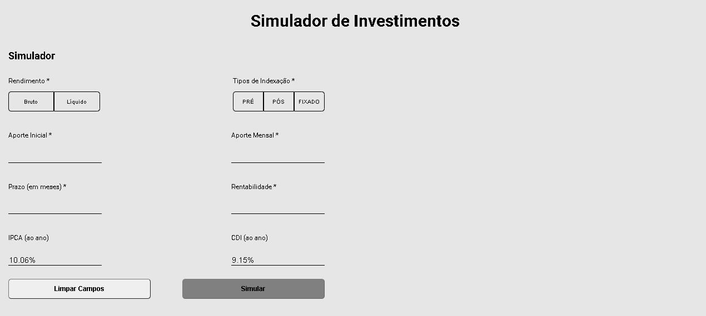
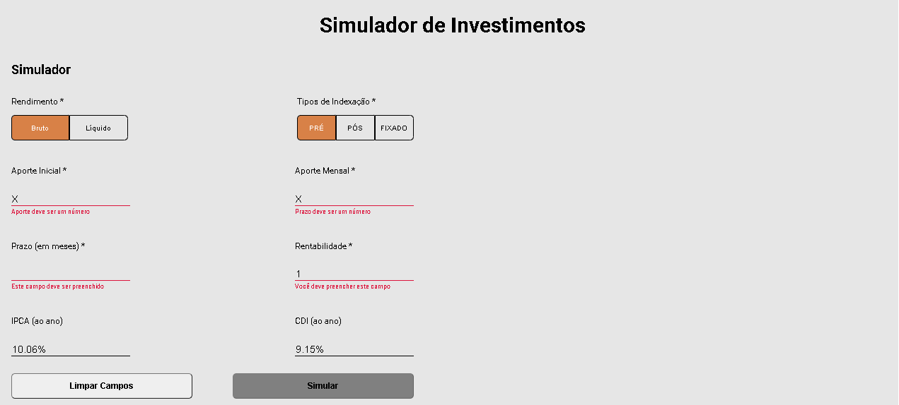
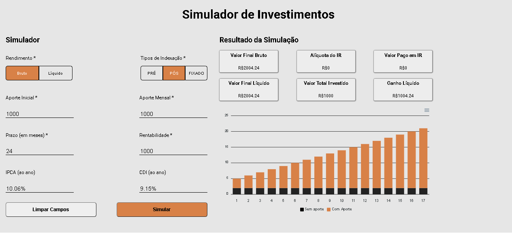
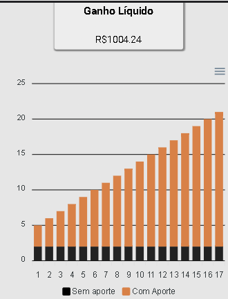
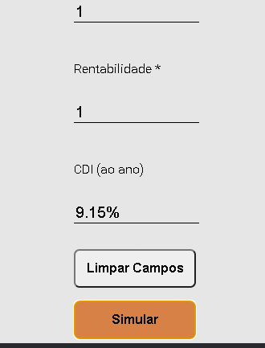

<h1 align="center">DESAFIO FRONTEND EQI INVESTIMENTOS</h1>
<p align="center" id="sobre">Desafio técnico de frontend proposto pela EQI investimentos. Trata-se 
de um simulador de investimentos, com a exibição de resultados contendo um gráfico e inputs
com valores que variam de acordo com as escolhas do usuário. </p>
Tabela de conteúdos
=================
<!--ts-->
    * [Sobre](#Sobre)
    * [Instalação](#instalacao)
    * [Pre Requisitos](#pre-requisitos)
    * [Tecnologias](#tecnologias)
<!--te-->

### Features

- [x] Validação de formulário
- [x] Responsividade
- [x] Gráfico

### Pré-requisitos 

<p id="pre-requisitos">Antes de começar, você vai precisar ter instalado em sua máquina a
ferramenta: 
[Node.js](https://nodejs.org/en/). 
Além disto é bom ter um editor para trabalhar com o código como [VSCode](https://code.visualstudio.com/)
</p>
<p>Primeiramente terá de rodar o servidor no back-end</p>

### Instalação
<p id="instalacao"></p>
### 🎲 Rodando o Back End (servidor)

```bash
# Clone este repositório
$ git clone <https://github.com/eqi-investimentos/desafio-fake-api>

# Acesse a pasta do projeto no terminal/cmd (procure o local onde foi feito o clone)
$ cd desafio-fake-api

# Instale as dependências
$ npm install

# Execute a aplicação em modo de desenvolvimento
$ npx json-server db.json

# O servidor inciará na porta:3000
```
### 🎲 Rodando o Projeto
```bash
# Clone o projeto em outra pasta
$ git clone <https://github.com/JoaoFPessoa/desafio-frontend-investimentos>

# Acesse a pasta clonada do projeto em
$ cd desafio-frontend-investimentos

# Instale as dependências
$ yarn

# Execute o projeto
$ yarn start

# A aplicação inciará na porta:3006
```

### 🛠 Tecnologias
<p id="tecnologias"></p>
As seguintes ferramentas foram usadas na construção do projeto:

- [Node.js](https://nodejs.org/en/)
- [React](https://pt-br.reactjs.org/)
- [Styled Components](https://styled-components.com/)
- [Apex Charts](https://apexcharts.com/)
- [Axios](https://axios-http.com/docs/intro)

### Screenshots
<h1 align="center">
  
  
  
  
  
</h1>