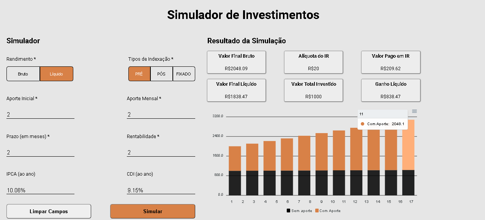
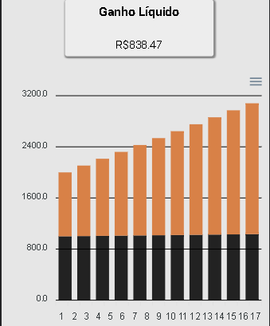

<h1 align="center">DESAFIO FRONTEND EQI INVESTIMENTOS</h1>
<p align="center" >Desafio técnico de frontend proposto pela EQI investimentos. Trata-se 
de um simulador de investimentos, com a exibição de resultados contendo um gráfico e inputs
com valores que variam de acordo com as escolhas do usuário. </p>

### Features

- [x] Validação de formulário
- [x] Responsividade
- [x] Gráfico

### Pré-requisitos 

<p>Antes de começar, você vai precisar ter instalado em sua máquina a
ferramenta: 
[Node.js](https://nodejs.org/en/). 
Além disto é bom ter um editor para trabalhar com o código como [VSCode](https://code.visualstudio.com/)
</p>
<p>Primeiramente terá de rodar o servidor no back-end</p>

### Instalação
### 🎲 Rodando o Back End (servidor)

```bash
# Clone este repositório
$ git clone <https://github.com/eqi-investimentos/desafio-fake-api>

# Acesse a pasta do projeto no terminal/cmd (procure o local onde foi feito o clone)
$ cd desafio-fake-api

# Instale as dependências
$ npm install

# Execute a aplicação em modo de desenvolvimento
$ npx json-server db.json

# O servidor iniciará na porta:3000
```
### 🎲 Rodando o Projeto
```bash
# Clone o projeto
$ git clone <https://github.com/JoaoFPessoa/desafio-frontend-investimentos>

# Acesse a pasta do projeto
$ cd desafio-frontend-investimentos

# Instale as dependências
$ yarn

# Execute o projeto
$ yarn start

# A aplicação iniciará na porta:3006 e abrirá automaticamente no seu browser
```

### 🛠 Ferramentas e Dependências
As seguintes ferramentas foram usadas na construção do projeto:

- [Node.js](https://nodejs.org/en/)
- [React](https://pt-br.reactjs.org/)
- [Styled Components](https://styled-components.com/) - Considero o styled a melhor forma para
tratar estilos no React, pois evita duplicidade em classes e tags, e traz grande dinamicidade
para os estilos através de props e temas globais.
- [Apex Charts](https://apexcharts.com/) - Utilizado para construção do gráfico.
- [Fetch] - Utilizado para requests entre o front e o backend
- [ESlint] - Junto com o prettier, faz com que seu código siga padrões e torne-se mais legível.
- [Prettier]

### Screenshots
<h1 align="center">
  
  
  
  
  
</h1>